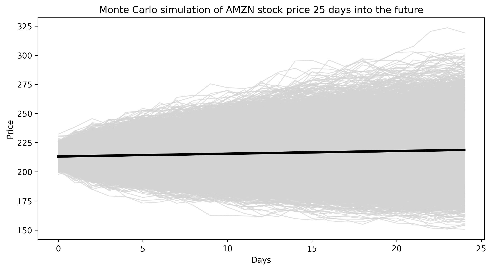

# Quantitative Risk: Monte Carlo Asset Simulator

This project implements a Monte Carlo simulation to model potential price paths for equity securities using historical data.

## Methodology
The simulator uses **Geometric Brownian Motion (GBM)** to project future price distributions. 
* **Data Source:** Market data is pulled dynamically via the `yfinance` API.
* **Analysis:** The model calculates log returns and annualised volatility to simulate $N$ potential paths.
* **Visualisations:** The output includes individual stochastic paths and a **central tendency (mean trace)** to visualise the expected value over the forecast horizon.

## Key Risk Metrics
- **Expected Value:** Represented by the thick black mean trace.
- **Volatility Clustering:** Observed through the dispersion of simulated paths.
- **Drift and Diffusion:** Parameters are estimated from the provided historical start/end dates.
  
To choose a stock ticker for the S&P 500 go here: https://en.wikipedia.org/wiki/List_of_S%26P_500_companies

To run the code, either use Jupyter notebooks from the command line, or open https://colab.research.google.com/ and upload the notebook so you can run it in your browser.

